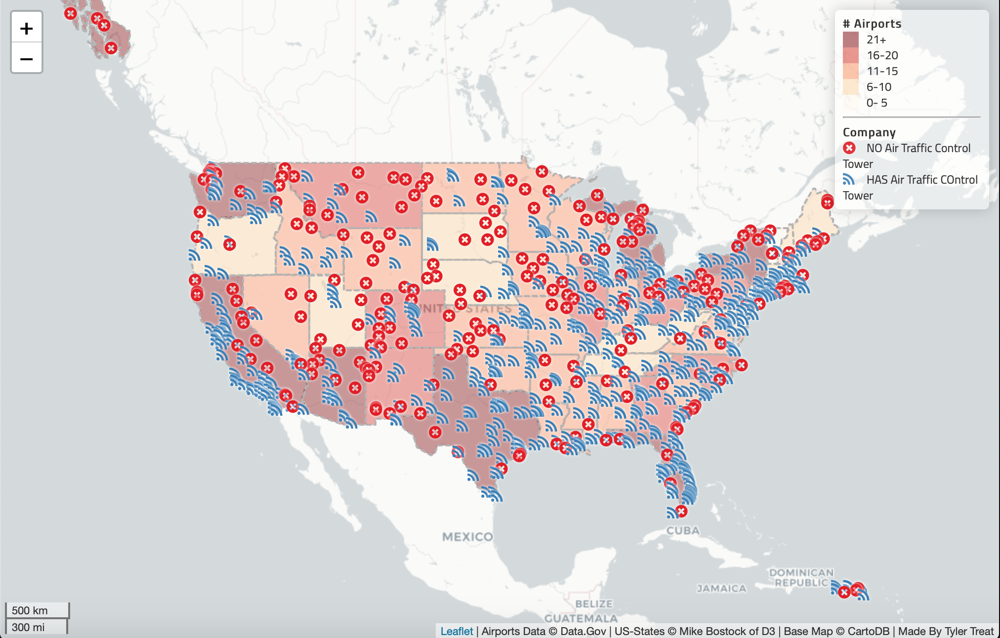
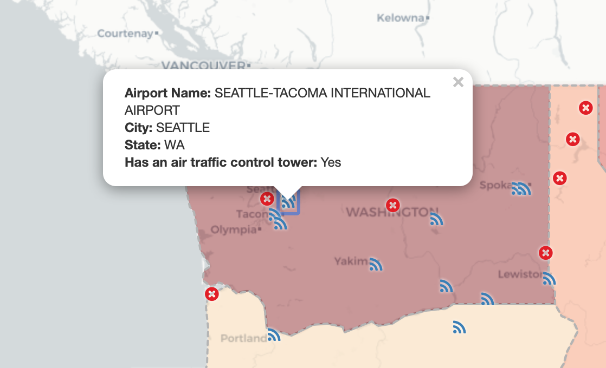
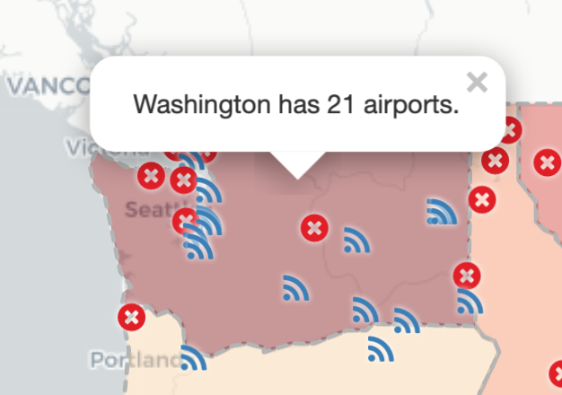

# U.S. Airports Web Map

**About**
This is an interactive web map of all the airports in the United States. Each airport is marked with icon on the map the respresents whether they have a traffic control tower or not. This icon, <i class="fa fa-rss marker"></i>, means yes while the red x means no. The basemap, a chloropleth map, shows how many airports are in each state by using a color ramp. The darker the color the more airports.

**Data / Layers**
- **_Airports_**
This layer contains all the specific airport data. This includes all the geolocated point for each airport and their respective icons as well as a popup containing other important metadata. **(Data gathered from [Data.gov](https://catalog.data.gov/dataset/usgs-small-scale-dataset-airports-of-the-united-states-201207-shapefile) and contains all the airports in the United States)**

- **_State Info_**
This layer is a chloropleth map layer that uses a color ramp to determine to number of airports within each states. To make it more clear to the readers, when a state is clickes, a popup will appear that provides to precise number of airports within that state.
**(collected as a geojson data file containing all the boundaries of each state in the United States. Collected from [Mike Bostock](https://bost.ocks.org/mike/) of [D3](https://d3js.org/).)**

**Libraries Sourced**
- https://ajax.googleapis.com/ajax/libs/jquery/3.1.0/jquery.min.js
- https://cdnjs.cloudflare.com/ajax/libs/chroma-js/1.3.4/chroma.min.js
- https://unpkg.com/leaflet@1.3.1/dist/leaflet.css
- https://cdnjs.cloudflare.com/ajax/libs/font-awesome/4.7.0/css/font-awesome.css
- https://fonts.googleapis.com/css?family=Titillium+Web
- https://unpkg.com/leaflet@1.4.0/dist/leaflet.js
- https://cdnjs.cloudflare.com/ajax/libs/leaflet-ajax/2.1.0/leaflet.ajax.min.js

**Acknowledgment**
- Professor Bo Zhao of the University of Washington
- Leaflet
- ajax.googlepis.com
- font-awesome
